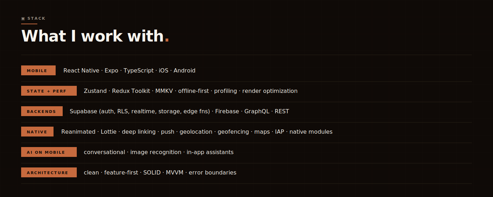
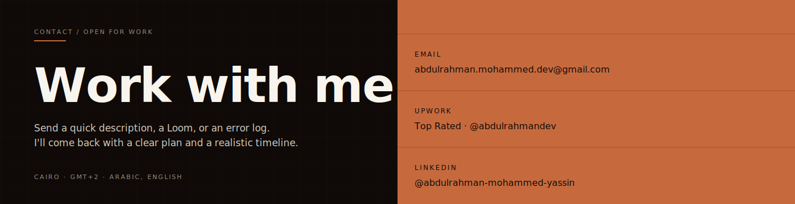

  

Senior React Native and Expo developer based in Cairo. Five years building production iOS and Android apps, leading the mobile workstream on each project, first commit through App Store and Play Store launch, including the post-release crash work and rejection cycles that take longer than the original build.

Recent work: AI-integrated mobile, healthcare and telehealth, real estate, and marketplaces. Comfortable across Supabase, Firebase, and GraphQL.

  <a href="https://abdulrahman-mobiledev.github.io"><b>↗ Portfolio: abdulrahman-mobiledev.github.io</b></a>

---

## Selected work

#### Gayar &nbsp;·&nbsp; 2022 → 2026 · nearly four years in production

Kuwait's first car-parts marketplace. Built and shipped iOS and Android from launch through four years of production use. TikTok, Snapchat, Meta, and Google Analytics SDKs for full-funnel event tracking and conversion attribution; deep-linked marketing campaigns route ad creative directly into product listings.

🟢 Live · 5k+ users on Google Play · [getgayar.com](https://www.getgayar.com/en) · [Google Play](https://play.google.com/store/apps/details?id=com.gayar) · [App Store](https://apps.apple.com/us/app/gayar-%D8%BA%D9%8A%D8%A7%D8%B1/id6478932610)

#### Nile University &nbsp;·&nbsp; 2023 → 2024

Two shipped apps for Nile University. The official student-facing app on iOS and Android with role-based access for students, staff, and visitors. Nile Gate, the internal campus security app: visitor registration, campus entry management, and event tracking.

🟢 Live · 5k+ users on Google Play · [nu.edu.eg](https://www.nu.edu.eg/students) · [Google Play](https://play.google.com/store/apps/details?id=com.nileuniversity) · [App Store](https://apps.apple.com/us/app/nile-university/id1637473286)

#### WZGate &nbsp;·&nbsp; 2024 → 2026 · 3 production apps · real estate, pet care

Three production apps. **Niche** and **Shari Real Estate**: property discovery with deep-link routing from ad campaigns, interactive map-based search with location filters, and an in-app AI assistant for buyer queries. **PetWell**: pet care with clinic discovery, appointment booking on a GraphQL backend, and digital pet health records.

[wzgate.com](https://wzgate.com/en)

#### ValuePlus &nbsp;·&nbsp; 2021 → 2023 · Enterprise ERP · 2 internal apps (POS, HR)

Saudi enterprise ERP. Dual apps deployed across multi-branch retail. POS with high-speed barcode scanning and real-time stock across branches. HR with geofenced attendance, digital employee profiles, and self-service approval workflows.

[valueerp.net](https://valueerp.net/ar)

#### FIXA &nbsp;·&nbsp; 2025 → present · private beta

Car services marketplace with AI diagnostics. Camera-based tire size scanning and AI issue identification take users from problem photo to booked diagnostic in one flow. Elasticsearch-backed parts search across service centers, replacing keyword matching with relevance-ranked results. Feature-first clean architecture across the platform.

#### Fitra360 &nbsp;·&nbsp; 2026 → present · private beta

AI wellness platform. Ingests DNA, bloodwork, symptoms, and lifestyle to generate personalized health and routine plans. Structured DNA and bloodwork data feed a conversational AI that produces individualized recommendations. Offline-first with MMKV + Zustand for fast cold starts and resilient sync.

#### Thought Craft &nbsp;·&nbsp; 2023 → 2024 · white-label · not public

White-label telemedicine. One codebase ships as a standalone consumer app or embeds inside a health-insurance partner app, with theming, auth, and routing all swappable per deployment. Zoom SDK for live doctor-patient consults: session lifecycle, in-call prescription generation, and mid-call access to medical history.

---

  

  ↗ Full breakdown of the toolkit on the <a href="https://abdulrahman-mobiledev.github.io">portfolio site</a>

---

  

  <a href="https://abdulrahman-mobiledev.github.io">Portfolio</a> &nbsp;·&nbsp;
  <a href="https://abdulrahman-mobiledev.github.io/abdulrahman-mohammed-cv.pdf">CV (PDF)</a> &nbsp;·&nbsp;
  <a href="mailto:abdulrahman.mohammed.dev@gmail.com">Email</a> &nbsp;·&nbsp;
  <a href="https://www.upwork.com/freelancers/abdulrahmandev">Upwork</a> &nbsp;·&nbsp;
  <a href="https://www.linkedin.com/in/abdulrahman-mohammed-yassin/">LinkedIn</a>

