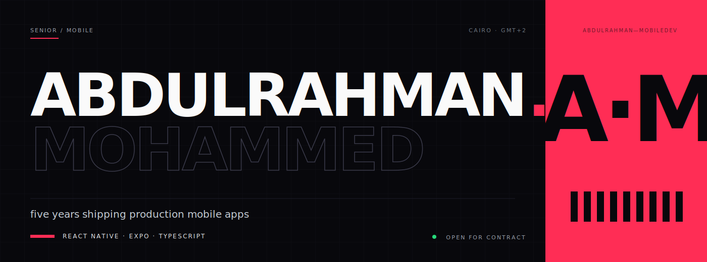

<p align="center">
  
</p>

Senior React Native and Expo developer based in Cairo. Five years building production iOS and Android apps, usually as the only mobile engineer on each project — first commit through App Store and Play Store launch, including the post-release crash work and rejection cycles that take longer than the original build.

Recent work: AI-integrated mobile, healthcare and telehealth, real estate, and marketplaces. Comfortable across Supabase, Firebase, and GraphQL.

---

### Selected work

**Fitra360** &nbsp;·&nbsp; *2026 → present*
AI wellness platform. Ingests DNA, bloodwork, symptoms, and lifestyle to generate personalized health and routine plans. Structured DNA and bloodwork data feed a conversational AI that produces individualized recommendations. Offline-first with MMKV + Zustand for fast cold starts and resilient sync. Currently in final testing before launch.

**FIXA** &nbsp;·&nbsp; *2025 → present*
Car services marketplace with AI diagnostics. Camera-based tire size scanning and AI issue identification take users from problem photo to booked diagnostic in one flow. Elasticsearch-backed parts search across service centers, replacing keyword matching with relevance-ranked results. Feature-first clean architecture across the platform.

**Gayar** &nbsp;·&nbsp; *2022 → 2026 · nearly four years in production*
Kuwait's first car-parts marketplace. Built and shipped iOS and Android from launch through four years of production use. TikTok, Snapchat, Meta, and Google Analytics SDKs for full-funnel event tracking and conversion attribution; deep-linked marketing campaigns route ad creative directly into product listings.

**WZGate** &nbsp;·&nbsp; *2024 → 2026 · agency work for direct clients*
Three production apps. **Niche** and **Shari Real Estate** — property discovery with deep-link routing from ad campaigns, interactive map-based search with location filters, and an in-app AI assistant for buyer queries. **PetWell** — pet care with clinic discovery, appointment booking on a GraphQL backend, and digital pet health records.

**Thought Craft** &nbsp;·&nbsp; *2023 → 2024*
White-label telemedicine. One codebase ships as a standalone consumer app or embeds inside a health-insurance partner app, with theming, auth, and routing all swappable per deployment. Zoom SDK for live doctor-patient consults — session lifecycle, in-call prescription generation, and mid-call access to medical history.

**ValuePlus** &nbsp;·&nbsp; *2021 → 2023*
Saudi enterprise ERP. Dual apps deployed across multi-branch retail. POS with high-speed barcode scanning and real-time stock across branches. HR with geofenced attendance, digital employee profiles, and self-service approval workflows.

---

### Two kinds of work

**New builds.** MVP through enterprise. AI features, healthcare and telemedicine, marketplaces, ERP / POS, real estate.

**Rescues.** Crashes, white screens, slow lists, laggy animations, broken navigation, auth bugs (Supabase, Firebase, OAuth, expo-auth-session), App Store and Play Store rejections, TestFlight issues.

---

### Stack

```
mobile        React Native · Expo · TypeScript · JavaScript (ES6+) · iOS · Android
state + perf  Zustand · Redux Toolkit · MMKV · offline-first · profiling · render optimization
backends      Supabase (auth, RLS, realtime, storage, edge fns) · Firebase · GraphQL · REST
native        Reanimated · Lottie · deep linking · push · geolocation · geofencing · maps · IAP · native modules
ai on mobile  conversational · image recognition · in-app assistants
architecture  clean / feature-first / SOLID / MVVM · error boundaries
store ops     App Store + Play Store submission · rejection handling
tools         Git · GitHub · GitLab · TestFlight · CI/CD
```

---

### Work with me

Send a quick description, a Loom, or an error log. I'll come back with a clear plan and a realistic timeline.

[Email](mailto:abdulrahman.mohammed.dev@gmail.com) &nbsp;·&nbsp; [Upwork](https://www.upwork.com/freelancers/abdulrahmandev) &nbsp;·&nbsp; [LinkedIn](https://www.linkedin.com/in/abdulrahman-mohammed-yassin/)

<sub>Cairo, Egypt · GMT+2 · Arabic (native), English (fluent) · Bachelor of Engineering, Cairo University</sub>
